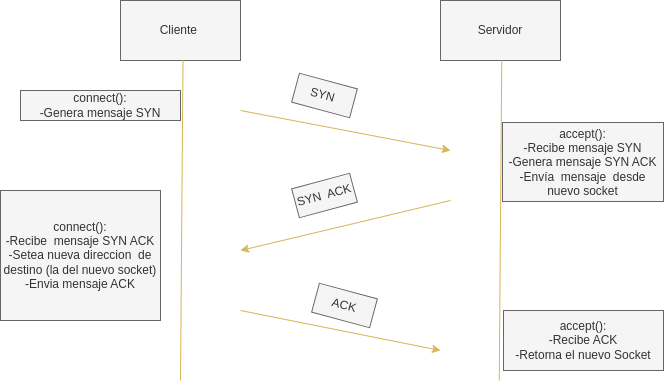

# Actividad 3
## Alumno: Lukas Vasuqez Verdejo

## Explicación Código
En esta actividad  se  implementa  la clase SocketTCP que simula una conexión TCP utilizando el protocolo UDP (User Datagram Protocol).

### create_segment()  and  parse_segment()
Estas funciones se encargan de transformar un mensaje TCP  a una estructura de Datos en python  y viceversa.

**parse_segment()**
Este método estático toma un mensaje TCP en forma de bytes y lo divide en sus componentes: SYN, ACK, FIN, SEQ y DATOS. Luego, devuelve estos componentes en un diccionario de la forma. 

```
{"SYN": int(TCP_list[0]),
"ACK": int(TCP_list[1]),
"FIN": int(TCP_list[2]),
"SEQ": int(TCP_list[3]),
"DATOS": TCP_list[4]
}
```
**create_segment()**
Este método estático toma un diccionario con componentes de un mensaje TCP (como el mencionado anteriormente) y lo convierte en un string formateada y la convierte en bytes para enviarla.El formato es el siguiente.

```
[SYN]|||[ACK]|||[FIN]|||[SEQ]|||[DATOS] 
```
### Three-way Handshake
El Handshake consta  de tres funciones  necesarias  para  su funcionamiento:  

**bind()**  
Este método simplemente asocia el socket UDP a una  dirección y un puerto específico.Llama al bind nativo de Socket UDP

**connect()**  
Este método simula el proceso de conexión TCP. Está  pensado para usarse desde el lado del emisor y envía un mensaje SYN al receptor, espera un mensaje SYN-ACK como respuesta y establece la conexión.Para establecer  la conección, primero se envía un SYN  hacia el receptor y se espera por  una respuesta SYN ACK  por parte de este.Si la respuesta es obtenida y cumple  la  restricción de SEQ==self.seq+1, se envía un último mensaje ACK  al receptor  y se setea  la  nueva  direccion de  destino (debido a que el receptor  ocupa  un socket  diferente del origianl  para  la comunicación).Para  manejar  las perdidas, si el emisor   no recibe  el SYN+ACK  desde  el receptor (se cumple  el timeout), se envía  nuevamente  el mensaje SYN original.El caso  en que  no se envíe correctamente  es manejado  dentro del send().


**accept()**  
Este método simula el proceso de aceptación de una conexión TCP entrante. Espera un mensaje SYN del emisor, responde con un SYN-ACK y establece la conexión con un nuevo socket (el nuevo socket  posee  una dirección  aleatoria  entre  1 y 50000).Finalmente espera  por  un ultimo ACK  por parte del emisor  y se  cumple  la restricción  SEQ==self.seq+1 el  nuevo socket  de comunicación es retornado en el lado del receptor.Para manejar las perdidas, en el caso de que  no se reciba el ACK  por parte  del emisor o si se recibe cuelquier otro mensaje, se envía  nuevamente el SYN ACK  al emisor.


**Diagrama de funcionamiento**



### Stop and Wait
La  implementación de Stop and Wait recae sobre dos métodos principales:

**send()**  
Este método simula el proceso de envío de datos a través de la conexión TCP. Divide los datos en paquetes y los envía al destino.El primer  paquete  contiene  la  información del largo total del mensaje (en seccion DATOS).Los  paquetes  son enviados en orden y esperan un ACK  por parte del receptor  para  enviar el siguiente (STOP AND WAIT).Si el ACK es recibido  correctamente  y corresponde al que tiene la secuencia adecuada, se actualiza el valor de la secuencia  y se procede a enviar el siguiente mensaje.Para manejar la perdidas, si el ACK  no es recibido (es decir se cumple  el timeout)  se envía  nuevamente el paquete al receptor.Para manejar el caso borde (si el ultimo ACK en el Handshake  no es recibido y el receptor  se mantiene en  un loop  esperando el mensaje) se tiene  que si  luego de  cuatro envíos del primer  paquete  no se recibe  un ACK , se envía  nuevamente el ACK del Handshake.
   

**recv()**  
Este método simula el proceso de recepción de datos de la conexión TCP. Recibe paquetes de datos y los ensambla en un mensaje completo devolviendo un ACK al emisor  luego de recibir cada paquete.Esta función puede recibir un mensaje  en diferentes llamadas  guardando los bytes pendientes.En cuanto a su implementaicón,se tiene que en primer lugar, si no se han establecido  la cantidad de bytes pendientes entonces se está recibiendo el primer  paquete (con el largo del mensaje) , con este  paquete  se establece la cantidad de bytes pendientes.Luego se tienen dos casos si el largo del mensaje  restante es mayor que el buff size declarado se recibirán paquetes hasta llenar el buffer, el mensaje sobrante  se guarda en  una variable (self.remainnig_message).Si el largo  del mensaje  restante es menor que  el buff size se obtienen  todos los paquetes.Notar que para que la función pueda ser llamada varias  veces  y funcione, se tiene que el mensaje sobrante (self.remaining_message) debe ser agregado al principio en la respuesta de cada llamada y retornar luego segpun el tamaño del buffer.Para manejar las pérdidas , si no se recibe el primer paquete (no tiene el largo en DATOS) no se hace nada (el emisor lo volverá a enviar luego del timeout), en los otros casos si se recibe  un mensaje previo se envía  un ACK  con la secuencia actual.

**Caso borde (no se recibe el ultimo ACK)**  
  
Notar  que el segundo ACK puede no ser recibido tambíen, pero el comportamiento sería denuevo el mismo mostrado en el diagrama


## Cierre de conexión

**close()**  
Este método simula el proceso de cierre de la conexión TCP. Envía un mensaje FIN al servidor y espera su respuesta.Si se recibe  un FIN ACK  se envía  3 ACKs separados por un sleep y se cierra  el socket.Para manejar las perdidas, si no se recibe  un FIN ACK luego de tres intentos  se cierra la conexion.

**recv_close()**  
Este método simula el cierre de conección por parte del receptor,Primero se espera la recepción de un mensaje FIN del cliente.Si este es obtenido se envía  un FIN ACK y se espera por el pultimo ACK del cliente,para cerrar la conección luego de su recepción.En el manejo de perdidas se tiene el caso en que  se recibió el último ACK en la parte del envía de datos (el emisor  sigue enviando el último paquete),si el receptor en recv_close  recibe el último packete envía  nuevamente un ACK.Por otra parte, si no se recibe el ultimo ACK  del  emisor (en el cierre de conexión) luego de 3 timeouts  simplemente se cierra la conexión

## Pruebas 
Usaremos el modo debug para revisa los resultados de las pruebas,el modo debug se activa  entregado debug=True en la instanciación del SocketTCP.

1.**Envío  de mensaje >16 bytes**:   
Si se envía  el siguiente mensaje "hola como estas  mi nombre es lukas" cuyo largo es 35 bytes el log en el servidor **Sin perdidas** es el siguiente:
```
Creando socket - Servidor
Waiting  for  requests
(Accept)SYN request:Establishing connection
(Accept)Sending SYN ACK  message
(Accept)waiting ACK
(Accept)recieved ACK:Conection Established 

(recv) Beginning recv, buff size 14
(recv)Initial reponse| remainnig bytes 36
(recv)case:message > buff size, remaining bytes 36
(recv)End recv: 14 bytes, response: b'hola como esta'
(recv)remainning_msg b's '
(recv)remainning_bytes 20 

(recv) Beginning recv, buff size 60
(recv)case:message < buff size, remaining bytes 20
(recv)End recv: 22 bytes, response: b's  mi nombre es lukas\n'
(recv)remainning_msg b's '
(recv)remainning_bytes 0 

Final resposne in server side:  b'hola como estas  mi nombre es lukas\n'
(recvClose) Starting closing
(recvClose)FIN recieved, sending FIN ACK to client
(recvClose) ACK recieved,Connection closed
(recvClose)Connection closed

``` 

Si aplicamos **Perdidas** con netem el log  en el servidor es el muy similar al enterior,se muestra la respuesta final:
```
.
.
(recv)remainning_bytes 0 

Final resposne in server side:  b'hola como estas  mi nombre es lukas\n'
(recvClose) Starting closing
(recvClose)FIN recieved, sending FIN ACK to client
.
.

```
Más  interesante es  el envío de paquetes por parte del cliente, para el primer paquete , las perdidas fueron:
```
(send)Beginning sending
(send)sending package 0  b'0|||0|||0|||29|||36'
(send) Wrong seq number
(send)sending package 0  b'0|||0|||0|||29|||36'
(send)timeout
(send)sending package 0  b'0|||0|||0|||29|||36'
(send)timeout
(send)sending package 0  b'0|||0|||0|||29|||36'
(send) Wrong seq number
(send)sending package 0  b'0|||0|||0|||29|||36'
(send)timeout
(send)sending package 0  b'0|||0|||0|||29|||36'
(send) Wrong seq number
(send)sending package 0  b'0|||0|||0|||29|||36'
(send)timeout
(send)sending package 0  b'0|||0|||0|||29|||36'
(send)timeout
(send)sending package 0  b'0|||0|||0|||29|||36'
(send) Wrong seq number
(send)sending package 0  b'0|||0|||0|||29|||36'
(send)timeout
(send)sending package 0  b'0|||0|||0|||29|||36'
(send) Wrong seq number
(send)sending package 0  b'0|||0|||0|||29|||36'
(send)timeout
(send)sending package 0  b'0|||0|||0|||29|||36'
(send) Wrong seq number
(send)sending package 0  b'0|||0|||0|||29|||36'
(send)timeout
(send)sending package 0  b'0|||0|||0|||29|||36'
(send)ACK recieved,seting SEQ to 31
```
2.**Comportamiento esperado paso 5**:  
Se implementan los mismos tests presentes en EOL.   
**Buff Size =16, len(msg)=16**  
Notar que basta 1 solo recv de 16 bytes
``` 
(recv) Beginning recv, buff size 16
(recv)Initial reponse| remainnig bytes 16
(recv)case:message < buff size, remaining bytes 16
(recv)End recv: 16 bytes, response: b'123456789012345\n'
(recv)remainning_msg b''
(recv)remainning_bytes 0 

Final resposne in server side: b'123456789012345\n' , len response16
(recvClose) Starting closing
```

**Buff Size =19, len(msg)=19**
Notar que basta 1 solo recv de 16 bytes

```
(recv) Beginning recv, buff size 19
(recv)Initial reponse| remainnig bytes 19
(recv)case:message < buff size, remaining bytes 19
(recv)End recv: 19 bytes, response: b'123456789012345678\n'
(recv)remainning_msg b''
(recv)remainning_bytes 0 

Final resposne in server side: b'123456789012345678\n' , len response19
```

**2 x Buff Size =14, len(msg)=19**
Notar que se hacen 2 recv  por parte del servidor

```(recv) Beginning recv, buff size 14
(recv)Initial reponse| remainnig bytes 19
(recv)case:message > buff size, remaining bytes 19
(recv)End recv: 14 bytes, response: b'12345678901234'
(recv)remainning_msg b'56'
(recv)remainning_bytes 3 

(recv) Beginning recv, buff size 14
(recv)case:message < buff size, remaining bytes 3
(recv)End recv: 5 bytes, response: b'5678\n'
(recv)remainning_msg b'56'
(recv)remainning_bytes 0 

Final resposne in server side: b'123456789012345678\n' , len response19
```
